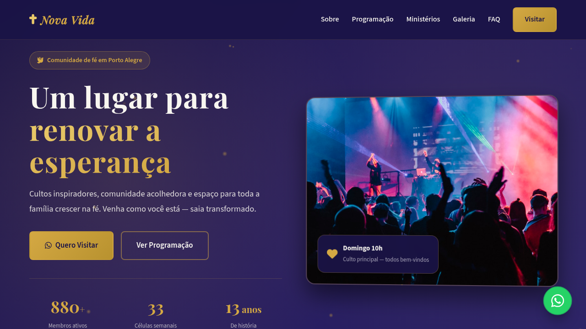
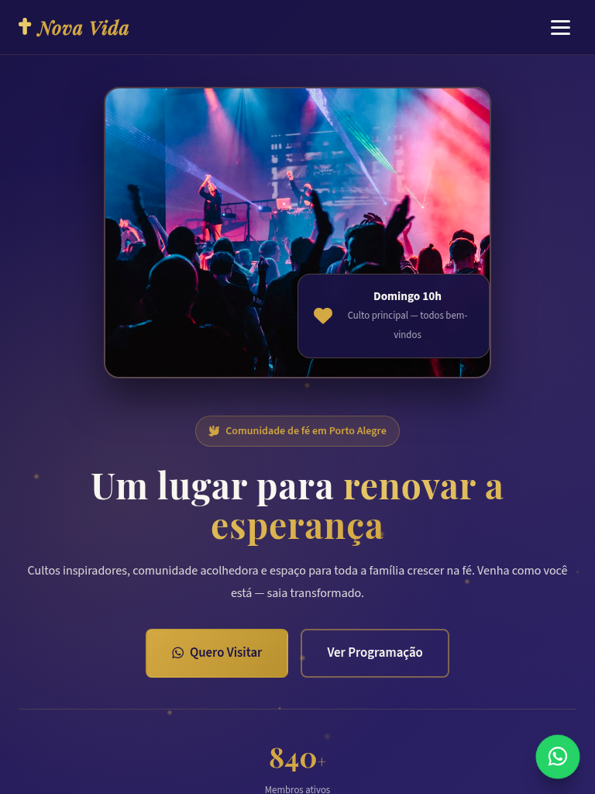
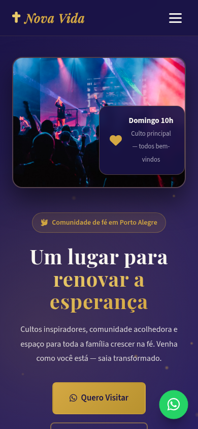

# Picada Café — Landing Page de Turismo

Landing page de alta conversão para turismo em **Picada Café** (Serra Gaúcha · Rota Romântica), com atrações autênticas, eventos locais, galeria visual e agendamento estruturado via WhatsApp.

[](https://tofariasti.github.io/turismo-picada-cafe/)

## Demo

**Moldura (preview):** [https://tofariasti.github.io/turismo-picada-cafe/](https://tofariasti.github.io/turismo-picada-cafe/)

**Tela cheia:** [https://tofariasti.github.io/turismo-picada-cafe/site/](https://tofariasti.github.io/turismo-picada-cafe/site/)

## Screenshots

### Desktop (1280px)


### Tablet (768px)


### Mobile (390px)


## Funcionalidades

- Design responsivo mobile-first com identidade visual regional
- Integração WhatsApp com formulário para agendar visita (nome, data, pessoas, roteiro)
- Animações AOS, partículas no hero, contadores e hover nos cards
- Seções: Hero, Como funciona, Atrações, Eventos, Galeria, FAQ e Contato
- Botão flutuante WhatsApp com pulse
- Acessibilidade: skip link, ARIA, contraste, foco visível, alt text
- Respeita `prefers-reduced-motion`
- Moldura iframe com preview desktop/tablet/mobile

## Pontos turísticos destacados

- **Parque Histórico Jorge Kuhn** — Centro de eventos na BR-116 com moinho colonial, museu e sede da Festa do Café, Cuca e Linguiça.
- **Mirante Edgar Michaelsen** — A cerca de 350 m acima do vale, oferece vista panorâmica das serras e da cidade.
- **Roteiro das Igrejas Históricas** — Cinco templos no Caminho da Fé, incluindo Nossa Senhora do Perpétuo Socorro.
- **Lajeado da Picada** — Formação natural entre rochas e piscinas, um dos cartões-postais ecológicos do município.
- **Morro do Vento** — Aventura com ponte pênsil, balanço infinito e voo livre a 380 m — paisagem de tirar o fôlego.
- **Pórtico de Picada Café** — Entrada emblemática na BR-116, marco de boas-vindas à cidade na subida da serra.

## Eventos

- **Tricofest** (Jul–Ago) — Festival de tricô e artesanato no Parque Histórico Jorge Kuhn.
- **Festa do Café, Cuca e Linguiça** (Ago) — 16ª edição com gastronomia típica, feira comercial e shows gratuitos.
- **Expoflorir** (Out) — Feira de flores, jardinagem e produtos coloniais no parque municipal.
- **Natal no Parque** (Dez) — Programação natalina com decoração, música e feira de artesanato.

## Tecnologias

- HTML5 semântico · CSS3 · JavaScript vanilla
- AOS 2.3.4 · Font Awesome 6.4 · Google Fonts (Rajdhani + Inter)

## Screenshots (geração)

```bash
python3 -m http.server 8765
npm install
npm run screenshots
```

## Repositório

https://github.com/tofariasti/turismo-picada-cafe

## Autor

**Tiago O. de Farias** — [Farias Digital](https://fariasdigital.com.br/)

---

<p align="center">
  <a href="https://tofariasti.github.io/turismo-picada-cafe/">🌐 Demo Online</a> ·
  <a href="https://fariasdigital.com.br/">🏢 Site Comercial</a>
</p>
